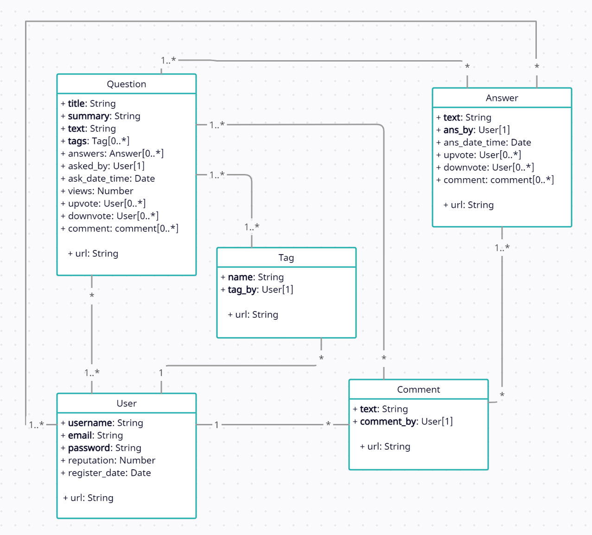

Read the Project Specfications [here](https://docs.google.com/document/d/1zZjNk9cbNLz0mp_-YtyZxhMzUph97fVgCkSE4u2k5EA/edit?usp=sharing).

## Instructions to setup and run project
This project uses MongoDB, Node.js, express, mongoose, nodemon, axios, cors, bcrypt, and no additional packages.

For the project to run you need to npm install all the packages mentioned in both the client and server directory.

Database Instance runs at `mongodb://127.0.0.1:27017/fake_so` 
Client Instance runs at `https://localhost:3000` 
Server Instance runs at `https://localhost:8000` 

Personally I run my server with `npx nodemon server.js` in the server directory. And client with `npm start` in the client directory. I open my database with `"C:\Program Files\MongoDB\Server\5.0\bin\mongod.exe" --dbpath="c:\data\db"`

After the instances are opened you would want to populate the database by navigating to the server directory and running the populate_db.js with the argument mongodb://127.0.0.1:27017/fake_so. `node populate_db.js mongodb://127.0.0.1:27017/fake_so`. This will populate the database for you. 

You can alter the data that is generated in populate_db.js to your liking. If you wish to create your own custom data, you can use the following provided methods in the populate section of the code.

userCreate(username, email, hashed password, register_date) 
username: String, REQUIRE  
email: String, REQUIRE 
hashed password: String (processed by bcrypt.hash), REQUIRE 
reputation: Integer 
register_date: Date objects 

tagCreate(name, tag_by) 
name: String, REQUIRE 
tag_by: User object, REQUIRE 

commentCreate(text,comment_by) 
text: String, REQUIRE 
comment_by: User object, REQUIRE 

answerCreate(text, ans_by, ans_date_time, upvote, downvote, comment) 
text:String, REQUIRE 
ans_by: User object, REQUIRE 
ans_date_time: Date object 
upvote: array of User objects 
downvote: array of User objects 
comment : array of Comment objects 

questionCreate(title, summary, text, tags, answers, asked_by, ask_date_time, views, upvote, downvote, comment) 
title: String, REQUIRE 
summary: String, REQUIRE 
text: String, REQUIRE 
tags: array of Tag objects, REQUIRE 
answers: array of Answer objects 
asked_by: User objects 
ask_date_time: Date object 
views: Integer 
upvote: array of User objects 
downvote: array of User objects 
comment : array of Comment objects 

You can test project with the following user:

username: some1  
email: some1@gmail.com 
password:123 
reputation: 0 

username: some2  
email: some2@gmail.com 
password:1234 
reputation: 100 

username: some3  
email: some3@gmail.com 
password:1235 
reputation: 50 

username: some4  
email: some4@gmail.com 
password:1236 
reputation: 101 

## Data Model

The UML model describes the schema for all documents in the MongoDB database
